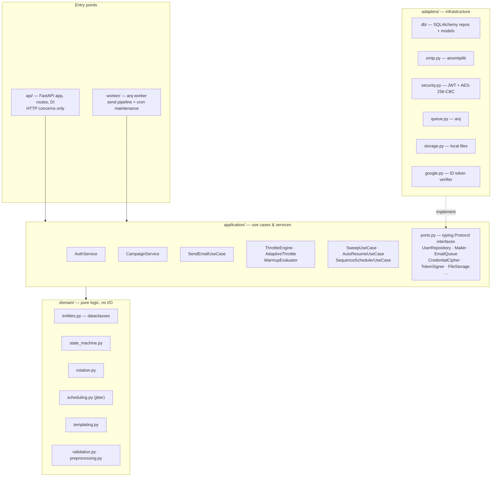
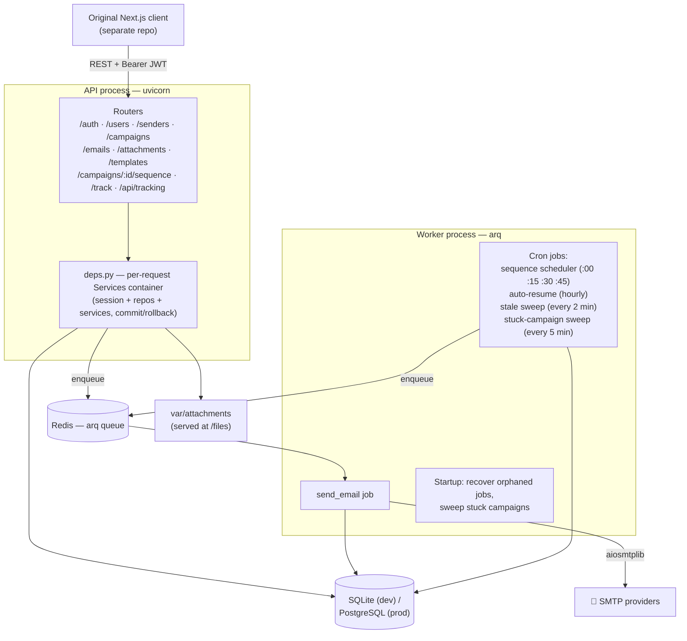
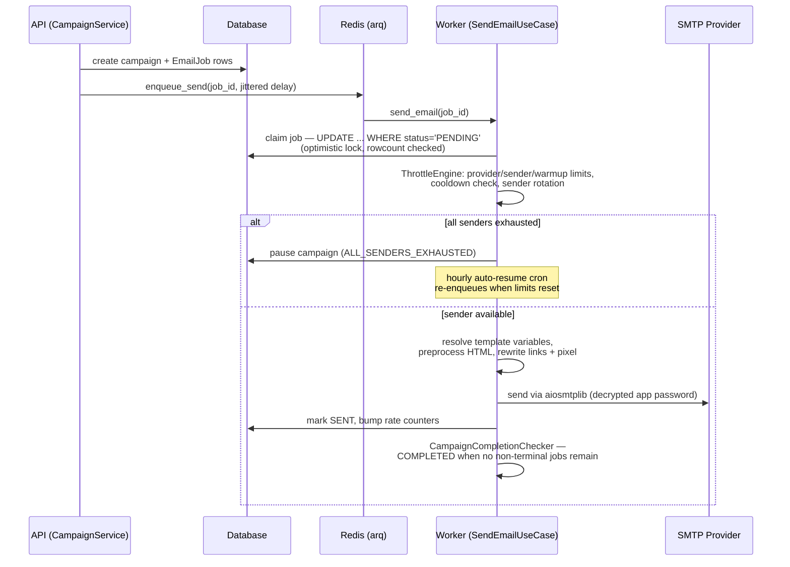
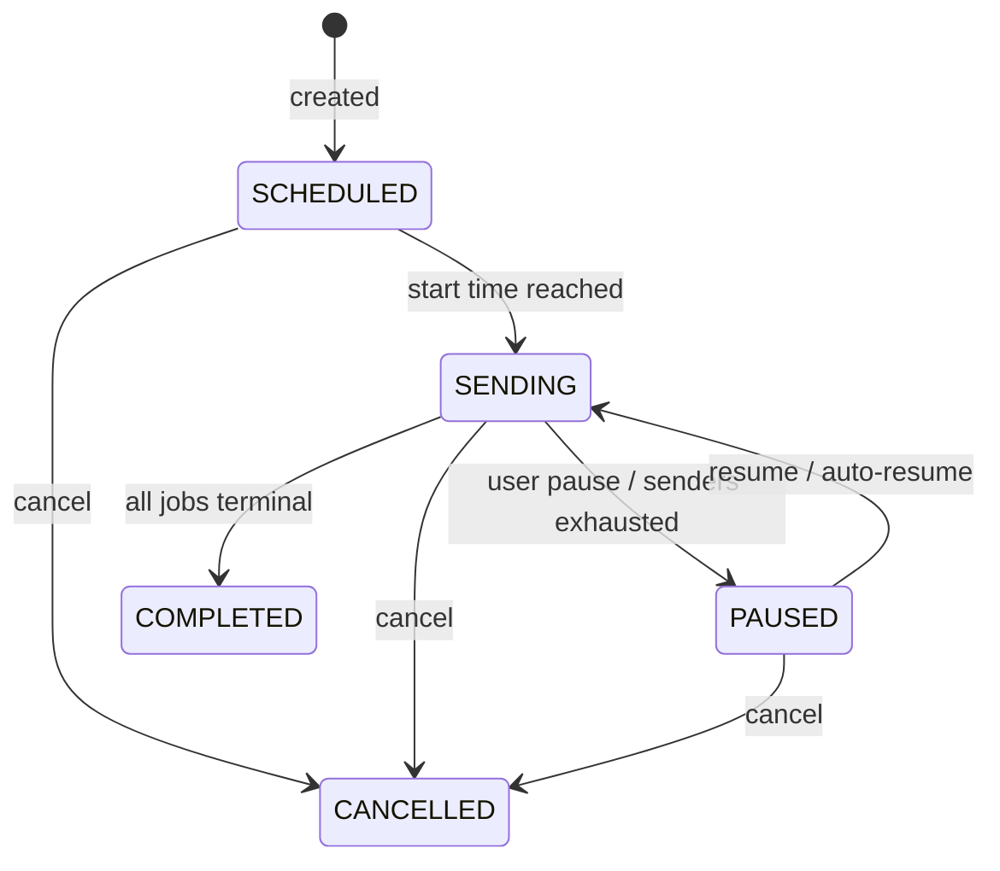

# Architecture

The defining feature of this port is its **hexagonal (ports & adapters) architecture**. Dependencies point inward only:

```
api / worker  →  application  →  domain
                     ↑
                 adapters (implement application's ports)
```

## Layer map



Conventions that make this work (from `CLAUDE.md`):

- **Ports are `typing.Protocol` classes** in `application/ports.py`; adapters satisfy them structurally — no inheritance, no registration.
- **Domain entities are plain dataclasses**; SQLAlchemy rows (`*Row` classes) map to them by field name via `to_entity`/`apply_entity`.
- **API JSON is camelCase** (parity with the original Express API) — `api/serialization.py` converts dataclasses recursively.
- **Errors are typed**: services raise `AppError` subclasses (`BadRequest`, `Unauthorized`, …); one FastAPI exception handler maps them to `{"message": ...}` responses with the original's exact strings.
- **All datetimes are UTC-aware** in code; the DB layer normalizes SQLite's naive values back to UTC on read.

## Runtime topology

Two processes share one database and one Redis:



Notable resilience choice: if Redis is unreachable at API startup, the app swaps in a **`NullEmailQueue`** that logs instead of enqueuing — the API stays up for everything except actual sending.

## The life of an email



Scheduling jitter (±20%/±40% ranges in `domain/scheduling.py`) spreads sends so the pattern looks human; throttling combines provider profile ceilings, per-sender limits, the 14-day warmup ramp (`[20..500]`), and adaptive slowdown on errors/bounces, with a cooldown after 3 consecutive failures.

## Worker self-healing

| Mechanism | When | What it does |
|---|---|---|
| Orphan recovery | Worker startup | Jobs stuck in `SENDING` from a crash → back to `PENDING`, re-enqueued |
| Stale sweep | Every 2 min (cron) | Jobs in `SENDING` longer than 5 min (hung SMTP) → reset and retried |
| Stuck-campaign sweep | Every 5 min + startup | Campaigns with no live jobs left → `COMPLETED` |
| Auto-resume | Hourly | Campaigns paused for `ALL_SENDERS_EXHAUSTED` resume when limits reset |
| arq retries | Per job | `max_tries = 3` on transient failures |

## State machines

Campaign transitions are validated by `domain/state_machine.py` and applied with optimistic concurrency (`update_status_if(id, from_status, to_status)`):



Email jobs: `PENDING → SENDING → SENT | FAILED | CANCELLED`. Statuses are `StrEnum`s — the DB stores plain strings and comparisons work both ways.

## Configuration

One Pydantic `Settings` class (`config.py`), env-driven with working dev defaults:

| Variable | Default | Purpose |
|---|---|---|
| `DATABASE_URL` | `sqlite+aiosqlite:///./outly.db` | SQLite for dev; `postgresql+asyncpg://...` for prod |
| `REDIS_URL` | `redis://localhost:6379` | arq queue |
| `ENCRYPTION_KEY` | all-zero dev key | AES-256 key, 64 hex chars |
| `JWT_ACCESS_SECRET` / `JWT_REFRESH_SECRET` | dev strings | Token signing |
| `ACCESS_TOKEN_EXPIRES` / `REFRESH_TOKEN_EXPIRES` | `15m` / `30d` | Token TTLs (`s/m/h/d` suffixes) |
| `GOOGLE_CLIENT_ID` | empty | OAuth audience |
| `SERVER_BASE_URL` / `TRACKING_BASE_URL` | `http://localhost:8000` / empty | Link/pixel URL building |
| `ATTACHMENT_DIR` | `var/attachments` | Local file storage |
| `WORKER_CONCURRENCY` | `5` | arq `max_jobs` |
| `ENV` | `development` | `production` enables secure cookies |

Tables are created on startup (`init_db` runs `create_all` — no Alembic), and provider profiles are seeded idempotently by both the API and the worker.
