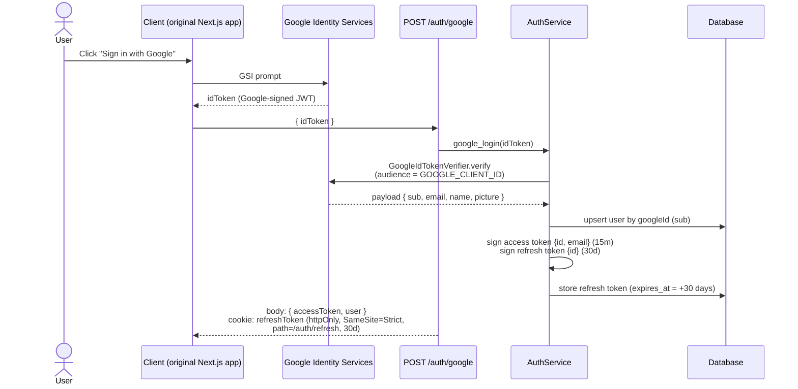
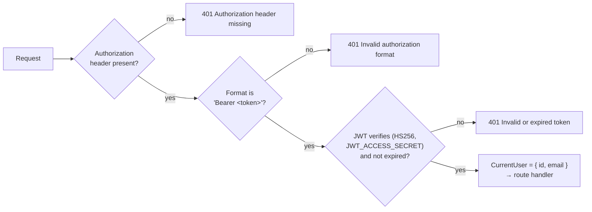
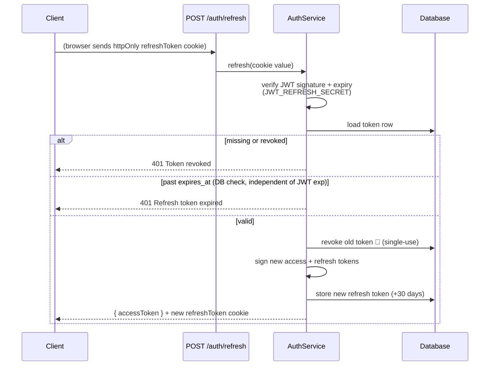
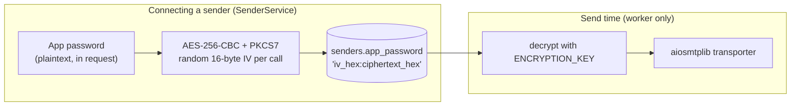

# Authentication

The auth design is ported 1:1 from the original Outly backend — same endpoints, same token semantics, same error strings — but reshaped into hexagonal layers. As in the original, there are **two distinct credential systems**:

1. **User authentication** — Google OAuth 2.0 + a JWT access/refresh token pair. Outly never stores a password for its own users.
2. **Sender credentials** — SMTP app passwords for the connected email accounts, stored encrypted with AES-256-CBC and decrypted only at send time.

## Where auth lives in the codebase

| Layer | File | Responsibility |
|---|---|---|
| API | `api/routes/auth.py` | `/auth/google`, `/auth/refresh`, `/auth/logout`; sets/clears the refresh cookie |
| API | `api/deps.py` → `get_current_user` | Bearer-token guard injected as the `CurrentUser` dependency |
| Application | `application/auth.py` → `AuthService` | Login, rotation, logout logic — framework-free |
| Ports | `application/ports.py` | `TokenSigner`, `GoogleVerifier`, `UserRepository`, `RefreshTokenRepository` Protocols |
| Adapters | `adapters/security.py` | `JwtTokenSigner` (PyJWT, HS256), `AesCredentialCipher` |
| Adapters | `adapters/google.py` | `GoogleIdTokenVerifier` (google-auth) |

Because `AuthService` only depends on Protocols, the whole flow is unit-testable with in-memory fakes — no Google, no database (see `tests/test_security.py`).

---

## 1. User authentication

### Design summary

| Concern | Mechanism |
|---|---|
| Identity | Google Sign-In ID token, verified server-side against `GOOGLE_CLIENT_ID` |
| Session | **Access token** — JWT (HS256), default TTL `15m`, sent as `Authorization: Bearer` |
| Renewal | **Refresh token** — JWT, default TTL `30d`, in an `httpOnly` cookie + persisted in the `refresh_tokens` table |
| Rotation | Single-use: every refresh revokes the old token and issues a new one |
| Replay defense | Each JWT carries a unique `jti` claim; DB row checked for `revoked` and `expires_at` |
| CSRF defense | Cookie is `SameSite=Strict`, scoped to `path=/auth/refresh` |
| Transport | `Secure` cookie flag when `ENV=production` |

### Login flow



Key points:

- The ID token is verified **server-side** — the backend never trusts the client's identity claim. A `None` result maps to `401 Invalid Google token`; a missing `sub`/`email`/`name` to `400 Incomplete Google profile` (exact parity with the original).
- Users are **upserted by `google_id`** (Google's stable `sub` claim), so the account persists across name/avatar changes.

### Dev-only login (local testing)

When `ENV=development` (the default), the app additionally mounts `POST /auth/dev-login` — it upserts a user by email and returns the same `{accessToken, user}` shape as the Google flow, no Google credentials needed:

```bash
curl -s -X POST http://localhost:8000/auth/dev-login \
  -H 'Content-Type: application/json' \
  -d '{"email": "me@example.com", "name": "Me"}'
```

The route is not registered at all when `ENV=production`, so it 404s there. Wired in `api/app.py` (`auth.dev_router`), implemented by `AuthService.dev_login`.

### Authenticated requests

Protected routers declare the `CurrentUser` dependency, which runs `get_current_user` (`api/deps.py`):



Every service call is then scoped by the user's id — data isolation is enforced in the repositories' WHERE clauses, exactly as in the original.

### Token refresh & rotation



A refresh token must pass **three gates**: JWT signature/expiry, DB `revoked = false`, and DB `expires_at` in the future. The DB expiry check is deliberate defense-in-depth — a token that was never explicitly revoked still dies on schedule even if its JWT claims were somehow accepted. Rotation makes every refresh token single-use, so a stolen token replayed after the legitimate client used it fails — and sessions can be revoked server-side at will.

One detail worth knowing: `JwtTokenSigner` stamps every token with `iat`, `exp`, and a random `jti` (UUID), so two tokens signed in the same second are still distinct — important because the refresh token string itself is the DB primary lookup key.

### Cookie hardening

Set in `api/routes/auth.py`:

```python
response.set_cookie(
    "refreshToken", token,
    max_age=30 * 24 * 60 * 60,   # 30 days
    path="/auth/refresh",        # only ever sent to the refresh endpoint
    httponly=True,               # invisible to JS (XSS containment)
    secure=(ENV == "production"),
    samesite="strict",           # never sent cross-site (CSRF)
)
```

The `path` restriction means the long-lived credential travels on exactly one route and nothing else.

### Logout

`POST /auth/logout` revokes the refresh token row and deletes the cookie, returning `204`. The short-lived access token simply ages out.

---

## 2. Email credential encryption

Sender SMTP app passwords are encrypted by `AesCredentialCipher` (`adapters/security.py`) — wire-compatible with the original TypeScript implementation, so a database written by one backend decrypts in the other:



Properties:

- **Key**: 32 bytes from `ENCRYPTION_KEY` (64 hex chars, `openssl rand -hex 32`), validated when the cipher is constructed at startup — fail-fast on a malformed key. The dev default is an all-zero key; set a real one in production.
- **Random IV per encryption** — identical passwords produce different ciphertexts, so duplicates can't be spotted by comparing database blobs.
- **Strict format validation on decrypt** — malformed or tampered ciphertext raises a clear `Malformed ciphertext` error instead of producing garbage.
- Decryption happens **only inside the worker at send time**; senders must pass a real SMTP verification before they're usable.

---

## Known trade-offs

Inherited from the original by design (parity over divergence):

- **Refresh tokens stored as raw JWT strings** in the database — revocation works, but hashing them at rest would protect sessions if the database leaked.
- **AES-CBC without an authentication tag** — ciphertext integrity relies on format validation rather than an AEAD mode like AES-GCM. Fine for this threat model (protecting credentials at rest), but GCM would be the modern default.
- **Dev secrets ship as defaults** (`dev-access-secret`, all-zero encryption key) so the repo runs out of the box — `ENV=production` does not currently refuse to start with dev secrets, so production deployments must remember to set real values.
