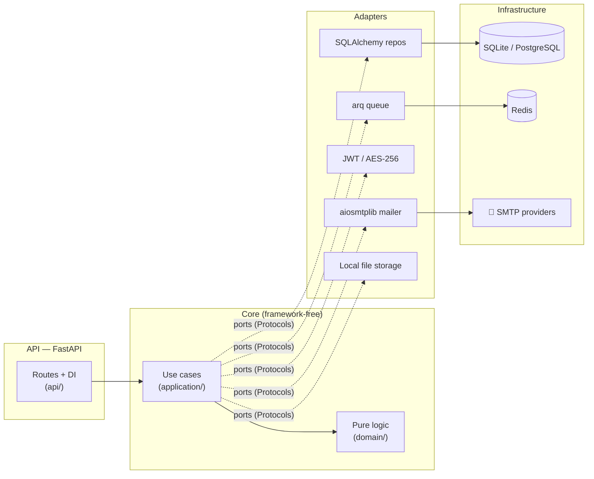

# Overview

## What is this repo?

This is a **Python port of [Outly](https://github.com/aniket1251/outly)** — a cold outreach email platform for job seekers. The original TypeScript backend (Express 5 + Prisma + BullMQ) is reimplemented in Python with **FastAPI**, **SQLAlchemy 2.0 (async)**, and **arq**, restructured as a **hexagonal architecture**.

It is **backend-only**: the API is route-for-route, status-code-for-status-code compatible with the original Express server, so the original Next.js client works against it unchanged. Functionally it does the same job: connect your own email accounts, import recipients, write templated emails, and let the engine handle human-like scheduling, sender rotation, warmup, throttling, follow-up sequences, and bounce/reply protection.

## How it relates to the original

| | Original (`outly`) | This repo (`outly-python`) |
|---|---|---|
| Language / framework | TypeScript, Express 5 | Python 3.12, FastAPI |
| ORM | Prisma 6 | SQLAlchemy 2.0 async |
| Queue | BullMQ | arq (still Redis) |
| Email | Nodemailer | aiosmtplib |
| Attachments | Cloudinary | Local filesystem, served at `/files/...` |
| Database | PostgreSQL | SQLite by default, PostgreSQL via `asyncpg` |
| Migrations | Prisma migrate | None — `create_all` on startup |
| Structure | Controllers / routes / utils | Hexagonal: `domain` → `application` → `adapters`/`api`/`worker` |
| Warmup ramp | 28 days | 14 days, `[20..500]` |
| Frontend | Next.js client included | None (use the original client) |

**Behavioral parity is a hard requirement** of the port: route paths, error message strings, state machines, throttle limits, scheduling jitter ranges (±20%/±40%), cooldown after 3 consecutive errors, and the worker recovery sweeps all match the original. When in doubt, the original `API_REFERENCE.md` is the spec.

## Key benefits

### Everything the original offers
Human-like send timing with jitter, multi-sender rotation with failover, adaptive warmup, per-provider/sender/minute/hour/day rate limits, cooldowns after consecutive SMTP errors, follow-up sequences (up to 5 steps), open/click tracking, and self-healing workers. See the original repo's docs for the full feature story — this port keeps it 1:1.

### What the rewrite adds

- **Hexagonal architecture** — pure business logic in `domain/` (no I/O, no framework imports), use cases in `application/` depending only on `typing.Protocol` ports, and swappable infrastructure in `adapters/`. The send pipeline can be tested without Redis, SMTP, or even Postgres.
- **Runs with zero infrastructure** — SQLite by default; if Redis is down the API degrades gracefully to a logging no-op queue instead of crashing. `uv sync && uv run pytest` works on a fresh machine.
- **Fully async stack** — FastAPI + SQLAlchemy async + aiosmtplib + arq, one consistent concurrency model end to end.
- **Optimistic concurrency where races matter** — campaign transitions, email-job claims, and sequence-step advancement all use `UPDATE ... WHERE id = ? AND status = ?` and check the rowcount, so two workers can never double-send.
- **Typed configuration** — a single Pydantic `Settings` class; dev defaults work out of the box.

## Tech stack at a glance

For how these pieces fit together, continue to [Architecture](./architecture.md).
